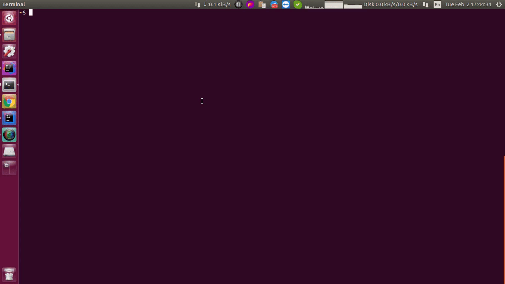

# tpb-cli 💻

Browse `thepiratebay` using terminal

## Why tpb-cli ? 🤷

Nowadays surfing though piratebay website is a messy task 😫.
Every time we click on something, we'll get fired with stupid ads. 
Only on the 3rd or 4th click, the intended task get executed. 

Due to this, finding a file's magnet takes approximately more than 4 minutes, plus our bandwidth will be misused 
for the stupid ads. 😠

## Install

- Download latest `JAR` from releases
- Run `java -jar tpb-cli.main.jar`

## Usage

```shell script
$ tpb
```

## Author

- theapache64


